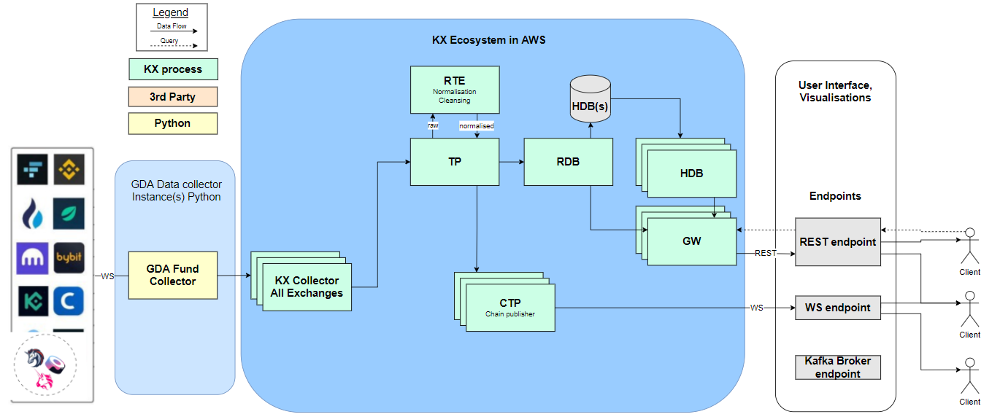

# GDA-Websocket
GDA Websocket Feed for cryptocurrencies

## Process flow chart


## Port Mapping
| Element     | Port Number |
|-------------|-------------|
| Tickerplant | 5000        |
| HDB         | 5002        |
| RDB         | 5008        |
| RTE         | 5112        |
| CTP         | 5110        |
| FH          | 5111        |
| GW          | 5005        |

## REST API

The `GW` process hosts a REST API endpoint which enables users to query the RDB and HDB via GET requests. The endpoint sits at `/getData` which if called without filters returns orders data from all instruments and exchanges over the past minute. The included filters are:

| Filter | Type            | Example                       | Available Values         |
|--------|-----------------|-------------------------------|--------------------------|
| tbls   | Atomic symbol   | order                         | order, trade             |
| sd     | Atomic timestamp | 2022.05.20D06:13:42.000000000 | N/A                      |
| ed     | Atomic timestamp | 2022.05.20D06:16:42.000000000 | N/A                      |
| ids    | Symbol list     | BTCUSD,ABC                    | BTCUSD, BTCUSDT          |
| exc    | Symbol list     | coinbase,bybit                | coinbase, bybit, binance |

### Examples

```bash
# Get data from all exchanges and instruments for the past minute
curl 'localhost:5005/getData'
# Get data from a specified start time to the current time 
curl 'localhost:5005/getData?sd=2022.05.20D04:42:40.000000000'
# Get data for a specified window of time 
curl 'localhost:5005/getData?sd=2022.05.20D04:42:40.000000000&ed=2022.05.20D04:43:40.000000000'
# Get data for a specific exchange (from a specified start time)
curl 'localhost:5005/getData?sd=2022.05.20D04:42:40.000000000&exc=binance'
# Get data for a specific instrument (from a specified start time)
curl 'localhost:5005/getData?sd=2022.05.20D04:42:40.000000000&ids=BTCUSD'
```


## Implementation into AWS

### Git

```git
git clone https://github.com/sbruce01/GDA-Websocket.git
```

Double check the startup script to see if the directories work correctly (Redhat vs Ubuntu slight differences)

### Developer

1. Put developer zip into the s3 bucket 
2. Unzip developer.zip
3. Install developer through `./install.sh`
4. Check Q definition ensuring commandline arguments are picked up (Can test with `q -p 5000` and `system"p"`)
5. Check the port defined in the `config.profile` is what's desired
6. Run developer:
```
source /path-to-install-dir/config/config.profile
q /path-to-install-dir/launcher.q_
```
7. Connect to developer using `IP`:`PORT`. N.B. `IP` will either be the Elastic IP Address or Private IP Address

### KX Websocket End point subscription
Connect your websocket client to ws://localhost:5110

A basic command is sent in the following format:
{"type": "sub", "tables": `[tableName]`,"syms":`[<SubscriptionSymbol>]`}

You may subscribe to multiple tables at a time by sending an array of subscription table names.

Please see examples in the ctp_ws.q 
